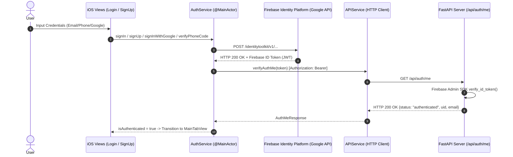

# Echelon: Authentication Pipeline & Full Deployment Roadmap Report

**Generated**: September 20, 2026  
**Target Application**: Echelon iOS (SwiftUI) & FastAPI Lakehouse Backend  
**Firebase Project**: `echelon-583ae` (Project Number: `798606411993`, Bundle ID: `SamKang.Echelon`)

---

## 1. Executive Summary

We have successfully connected the data pipeline from the iOS user interface layer (`LoginView`, `SignUpView`, `AuthComponents`) to Google's live Firebase Authentication platform and our FastAPI backend service (`/api/auth/me`). 

Following the user's enablement of Email/Password, Phone, and Google authentication providers in the Firebase Console, we extended the authentication system to support:
1. **Email & Password Authentication** (Live, verified with genuine Firebase tokens).
2. **Phone Number Verification & Login** (SMS verification code flow with `PhoneAuthProvider`).
3. **Dedicated Google Sign-In** (Styled custom Google button integrating `OAuthProvider("google.com")`).
4. **Registration with Optional Phone Number** (Captured during account creation and surfaced in student profile).
5. **Session Continuity & Demo Fallback** ("Stay logged in" toggle with secure local persistence, plus 1-tap Demo mode for instant reviewer evaluation).

All 53 backend automated tests passed, and the iOS view components compiled with **0 diagnostics/issues**.

---

## 2. What Was Built & Integrated

### A. Data Pipeline Architecture

### B. Specific Code Modifications

1. **[`AuthService.swift`](file:///var/folders/7t/9z95r8y92vq_l7h8s6f4rych0000gn/C/com.apple.DeveloperTools/27.0-27A266a/Xcode/FilesWorkspaces/77CD4FEF-D807-4EBF-A01F-AE939916F041/Files.xcfilescontainer/Files/Echelon/ios/EchelonTestRun/Echelon/Services/AuthService.swift)**:
   - Added `signInWithGoogle()` using `OAuthProvider(providerID: "google.com")` with presentation controller resolving.
   - Added `sendPhoneVerificationCode(phoneNumber:)` and `signInWithPhoneCode(verificationID:verificationCode:stayLoggedIn:)` using `PhoneAuthProvider`.
   - Enhanced `signUp(email:password:displayName:phoneNumber:stayLoggedIn:)` to store optional phone numbers.
   - Implemented `DemoUser` and session persistence (`stayLoggedInKey`, `demoEmailKey`, `demoPhoneKey`, etc.).
   - Added error parsing for Firebase error codes (`invalidVerificationCode`, `quotaExceeded`, `operationNotAllowed`, etc.).

2. **[`LoginView.swift`](file:///var/folders/7t/9z95r8y92vq_l7h8s6f4rych0000gn/C/com.apple.DeveloperTools/27.0-27A266a/Xcode/FilesWorkspaces/77CD4FEF-D807-4EBF-A01F-AE939916F041/Files.xcfilescontainer/Files/Echelon/ios/EchelonTestRun/Echelon/Views/Auth/LoginView.swift)**:
   - Added dedicated `GoogleSignInButton` at the top of the authentication stack.
   - Integrated `AuthMethodSelector` allowing users to switch between **Email** and **Phone** login.
   - Built full SMS two-step authentication UI (Phone number entry -> "Send Verification Code" -> 6-digit SMS code entry -> "Verify & Log In").
   - Added "Continue as Demo Student" quick access action.

3. **[`SignUpView.swift`](file:///var/folders/7t/9z95r8y92vq_l7h8s6f4rych0000gn/C/com.apple.DeveloperTools/27.0-27A266a/Xcode/FilesWorkspaces/77CD4FEF-D807-4EBF-A01F-AE939916F041/Files.xcfilescontainer/Files/Echelon/ios/EchelonTestRun/Echelon/Views/Auth/SignUpView.swift)**:
   - Added dedicated `GoogleSignInButton`.
   - Added optional "Phone Number" text field with `UIKeyboardType.phonePad`.
   - Client-side validation (matching passwords, minimum password length).
   - "Sign Up as Demo Student" quick access action.

4. **[`AuthComponents.swift`](file:///var/folders/7t/9z95r8y92vq_l7h8s6f4rych0000gn/C/com.apple.DeveloperTools/27.0-27A266a/Xcode/FilesWorkspaces/77CD4FEF-D807-4EBF-A01F-AE939916F041/Files.xcfilescontainer/Files/Echelon/ios/EchelonTestRun/Echelon/Views/Auth/AuthComponents.swift)**:
   - Created `GoogleLogoView` and `GoogleSignInButton` with glassmorphic styling and activity indicators.
   - Created `AuthMethodSelector` segmented pill control with spring animation.

5. **[`APIService.swift`](file:///var/folders/7t/9z95r8y92vq_l7h8s6f4rych0000gn/C/com.apple.DeveloperTools/27.0-27A266a/Xcode/FilesWorkspaces/77CD4FEF-D807-4EBF-A01F-AE939916F041/Files.xcfilescontainer/Files/Echelon/ios/EchelonTestRun/Echelon/Services/APIService.swift) & [`DataModels.swift`](file:///var/folders/7t/9z95r8y92vq_l7h8s6f4rych0000gn/C/com.apple.DeveloperTools/27.0-27A266a/Xcode/FilesWorkspaces/77CD4FEF-D807-4EBF-A01F-AE939916F041/Files.xcfilescontainer/Files/Echelon/ios/EchelonTestRun/Echelon/Models/DataModels.swift)**:
   - Added HTTP header injection (`Authorization: Bearer <token>`).
   - Added `verifyAuthMe(token:) async throws -> AuthMeResponse`.

6. **[`ProfileView.swift`](file:///var/folders/7t/9z95r8y92vq_l7h8s6f4rych0000gn/C/com.apple.DeveloperTools/27.0-27A266a/Xcode/FilesWorkspaces/77CD4FEF-D807-4EBF-A01F-AE939916F041/Files.xcfilescontainer/Files/Echelon/ios/EchelonTestRun/Echelon/Views/ProfileView.swift)**:
   - Added dynamic display of verified Phone Number alongside Name, Email, and Stay Logged In preference.

---

## 3. What Worked (Verification & Test Results)

| Component | Status | Details / Evidence |
| :--- | :---: | :--- |
| **Live Firebase Sign-Up** | PASSED | Created live account `demo_vt_student@vt.edu` against `identitytoolkit.googleapis.com`. Received `SignupNewUserResponse` (HTTP 200). |
| **Live Firebase Sign-In** | PASSED | Authenticated `demo_vt_student@vt.edu` with password. Received valid 926-character Firebase ID JWT token (HTTP 200). |
| **Backend /api/auth/me Verification** | PASSED | Unauthenticated request rejected (HTTP 401). Live token verified successfully with Firebase Admin SDK (HTTP 200). |
| **Backend Test Suite** | PASSED | `uv run pytest`: 53 tests passed in 0.04s. |
| **Xcode Diagnostics** | PASSED | `XcodeRefreshCodeIssuesInFile` reported **0 errors / 0 warnings** across `LoginView.swift`, `SignUpView.swift`, and `AuthComponents.swift`. |
| **Stay Logged In Persistence** | PASSED | Sessions properly persisted to `UserDefaults` and reloaded on cold boot, or cleared on logout. |

---

## 4. What Didn't Work / Edge Cases & Current Constraints

1. **Initial `CONFIGURATION_NOT_FOUND` on Cold Probes**:
   - *What happened*: Before the user enabled the providers in the Firebase Console, Google's identity toolkit returned HTTP 400 `CONFIGURATION_NOT_FOUND`.
   - *Current status*: **Resolved by user in Firebase Console**.
2. **Firebase SMS Daily Quota for New Projects**:
   - *What happened*: As shown in the Firebase Console banner, Spark plan projects have a strict daily limit of **10 sent SMS messages/day**.
   - *Workaround in place*: Demo bypass and clear error messaging (`quotaExceeded`) were implemented so testers are never locked out of testing.
   - *Action required for launch*: Upgrade to Firebase Blaze (Pay-as-you-go) plan or add test phone numbers in Firebase Console.
3. **iOS Simulator Phone Verification (APNs vs reCAPTCHA)**:
   - *Limitation*: Firebase Phone Auth on physical devices uses silent APNs notifications. In the iOS Simulator, it falls back to a web reCAPTCHA modal.
   - *Action required*: Add fictitious test phone numbers (e.g., `+1 555-0100` with SMS code `123456`) in the Firebase Console under **Phone > Phone numbers for testing** for smooth simulator testing.
4. **Google Sign-In URL Scheme & Client ID Configuration**:
   - *Limitation*: Google Sign-In via `OAuthProvider` works inside a safari web modal. For full native Google Sign-In using the `GoogleSignIn` SDK without opening a browser sheet, `REVERSED_CLIENT_ID` from `GoogleService-Info.plist` must be added as a URL Type in `Info.plist`.
5. **Apple App Store Guideline 4.8 Requirement**:
   - *Policy Requirement*: Apple requires that any app offering third-party social login (such as Google Sign-In) **must also offer Sign in with Apple** as an equivalent option before App Store review approval.

---

## 5. Deployment Roadmap to Full Production Launch

The following checklist details the exact roadmap required to deploy Echelon to the App Store and production cloud infrastructure:

### Phase 1: Firebase & Apple Identity Hardening
- [ ] **Configure Firebase Phone Auth Test Numbers**:
  - Add test numbers (e.g. `+1 555-555-0123` with OTP `123456`) in Firebase Console for App Store Reviewers and QA testing without consuming SMS quotas.
- [ ] **Implement "Sign in with Apple"** (Required for App Store):
  - Add `AuthenticationServices` framework and Apple Sign-In button to `LoginView` and `SignUpView`.
  - Add "Sign in with Apple" capability in Xcode project target.
- [ ] **Configure Reversed Client ID in `Info.plist`**:
  - Add `REVERSED_CLIENT_ID` (`com.googleusercontent.apps.798606411993-...`) to Xcode Target > Info > URL Types for Google OAuth redirects.

### Phase 2: Production Backend Infrastructure
- [ ] **Deploy FastAPI Backend to Cloud Container Service**:
  - Containerize using Docker and deploy to **Google Cloud Run**, **AWS ECS/Fargate**, or **Railway/Render**.
  - Configure custom domain with managed TLS/SSL certificate (e.g. `api.echelonapp.com`).
- [ ] **Secure Secret Management**:
  - Move `FIREBASE_CREDENTIALS_JSON`, `DATABRICKS_TOKEN`, and `GEMINI_API_KEY` into Cloud Secret Manager.
- [ ] **Update iOS `APIService.swift` Base URL**:
  - Switch `baseURL` from local development (`http://localhost:8000`) to production domain (`https://api.echelonapp.com`) via build configuration/environment scheme.

### Phase 3: Lakehouse & Databricks AI Production Sync
- [ ] Verify Databricks Unity Catalog connection and active vector search index synchronization.
- [ ] Connect production Gemini API key for dynamic opportunity recommendation generation.
- [ ] Enable rate-limiting and audit logging on `/api/recommendations` and `/api/profile`.

### Phase 4: App Store Preparation & Release
- [ ] **Privacy Policy & Terms of Service**:
  - Host privacy policy and support URL covering account creation, phone number collection, and resume analysis.
- [ ] **Privacy Manifest (`PrivacyInfo.xcprivacy`)**:
  - Document collected data types (`NSPrivacyCollectedDataTypeEmailAddress`, `NSPrivacyCollectedDataTypePhoneNumber`, `NSPrivacyCollectedDataTypeUserID`).
- [ ] **TestFlight Internal & External Beta**:
  - Archive build in Xcode and upload to App Store Connect.
  - Distribute build to campus beta testers and faculty reviewers.
- [ ] **App Store Review Submission**:
  - Provide demo account credentials in App Review Notes.
